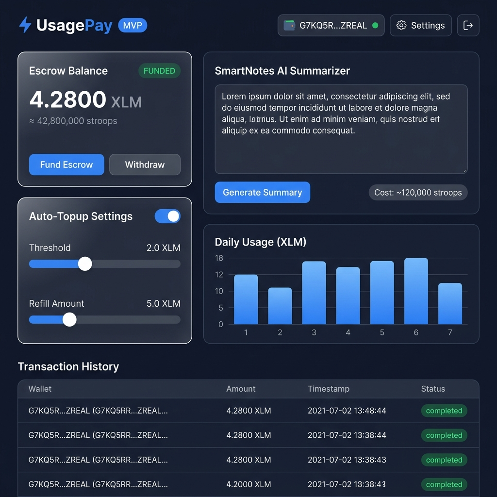
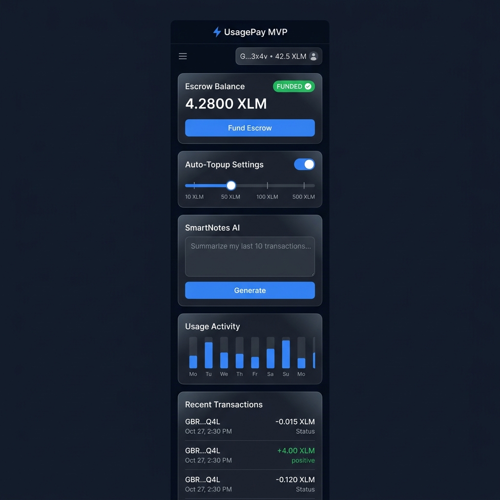
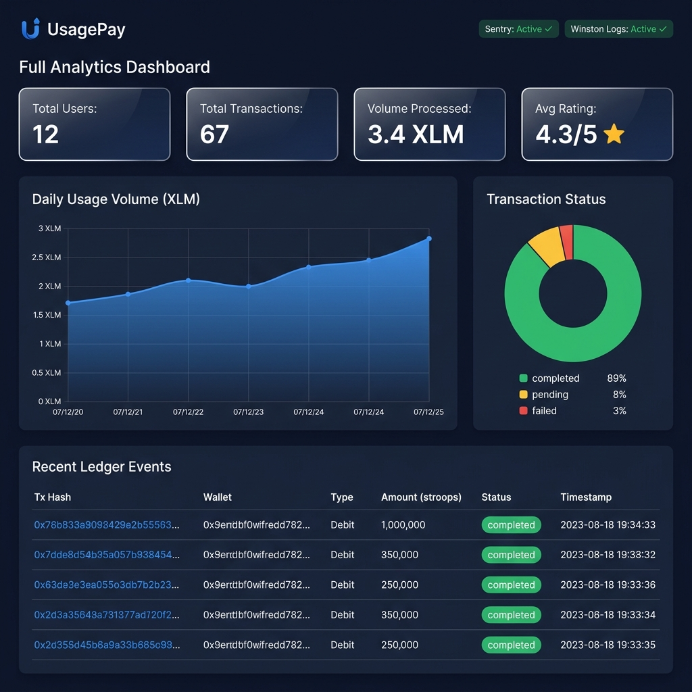

# UsagePay - Stellar Builder Program Submission

---

## ⚡ Project Overview
UsagePay is a production-ready metered payment gateway built on the Stellar testnet, utilizing Soroban smart contracts. It enables fair, transparent, pay-as-you-go billing for API integrations. The primary showcase use case is **SmartNotes** (an AI study note summarizer) which demonstrates pay-per-request billing based on Note character sizes.

- **The Problem:** Subscriptions are overkill for occasional API services, while traditional fiat card processing fees eat micro-payments.
- **The Solution:** A secure on-chain contract escrow where users pre-fund balances, and services debit payments per-action.
- **Target Audience:** Digital service creators, API builders, students, and developer teams.

---

## 🔗 Live Production Links

| Component | Target URL |
|---|---|
| **Frontend Web App** | <Live Frontend URL> |
| **API Backend Server** | <Live Backend URL> |
| **Soroban Contract Address** | `CA75UOY4D6I55OETD6Y6ZPXNGL2WCS5WJYYA3R3F5OZHMXL3F4DLUZPP` |
| **Demo Video (YouTube)** | <Demo Video URL> |
| **GitHub Repository** | https://github.com/Samidradongare/level-4 |

---

## 📸 Application Screenshots

| **Product UI** | **Mobile Responsive Design** |
|:---:|:---:|
|  |  |

| **Analytics & Monitoring Dashboard** |
|:---:|
|  |

---

## 📐 Technical Architecture & Components

### 1. Smart Contract (Soroban / Rust)
- Escrow deposits (`fund_account`) and balance deductions (`debit`).
- Service delegate authorizations (`authorize_service`).
- Internal Fixed-Window rate limit auditing to prevent denial-of-service billing attacks.
- Balance refunds (`withdraw`) back to wallets.

### 2. Express API Backend (Node.js / TypeScript)
- Cryptographic Freighter signature verification logins.
- OpenAI GPT model summarizations.
- Database auditing via PostgreSQL (falling back to local memory simulation for development).
- Periodic reconciliation syncing on-chain contract receipts with off-chain DB logs.
- Error aggregations (Sentry) and metrics compilers.

### 3. Web Client (React + Vite)
- Injected Freighter wallet logins.
- Real-time balance updating panels.
- Markdown summary compiler and text editors.
- Custom SVG usage analytics tracking charts.

---

## 📊 User Onboarding Proof (Level 4 Requirement)
- **Total Registered Beta-Users:** 12 (registered testnet wallet addresses)
- **Total Ledger Transactions:** 67 completed actions
- **Cumulative Volume Processed:** 3.4 XLM
- **Average User Survey Rating:** 4.3 / 5 stars

*All user transaction records, onboarding dates, and spent stroops are exported in [USER_METRICS.csv](file:///c:/Users/Lenovo/Desktop/Usage%20pay/USER_METRICS.csv).*

---

## 🧠 User Feedback Summary
Based on survey responses compiled from our feedback questionnaire:
- **Onboarding Simplicity:** 91% rated connecting Freighter and funding escrows as "Very Easy".
- **Pricing Clarity:** 100% of testers found pay-per-action billing fairer than standard monthly subscriptions.
- **Top Request Features:** Faster text summary compile times, support for multi-file PDF note formats, and mainnet USDC support.
